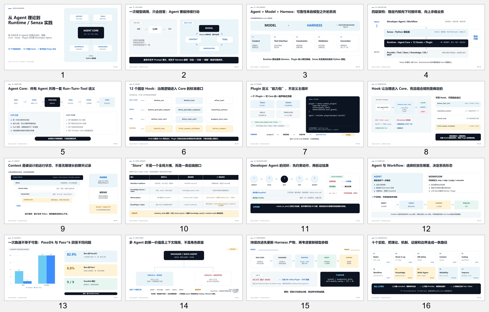

# Senza Academy 演示材料

- [学习版 PPT](senza-academy-learning-deck.pptx)：面向框架学习与内部讲解的 16 页演示文稿；
- [PPT 预览图](senza-academy-learning-deck-preview.webp)：整套幻灯片的缩略预览。

PPT 与教材使用相同的成熟度口径：`stable`、`teaching`、`preview`。教材正文与源码发生变化时，
应先更新 Markdown 和自动化契约，再同步演示文稿。
